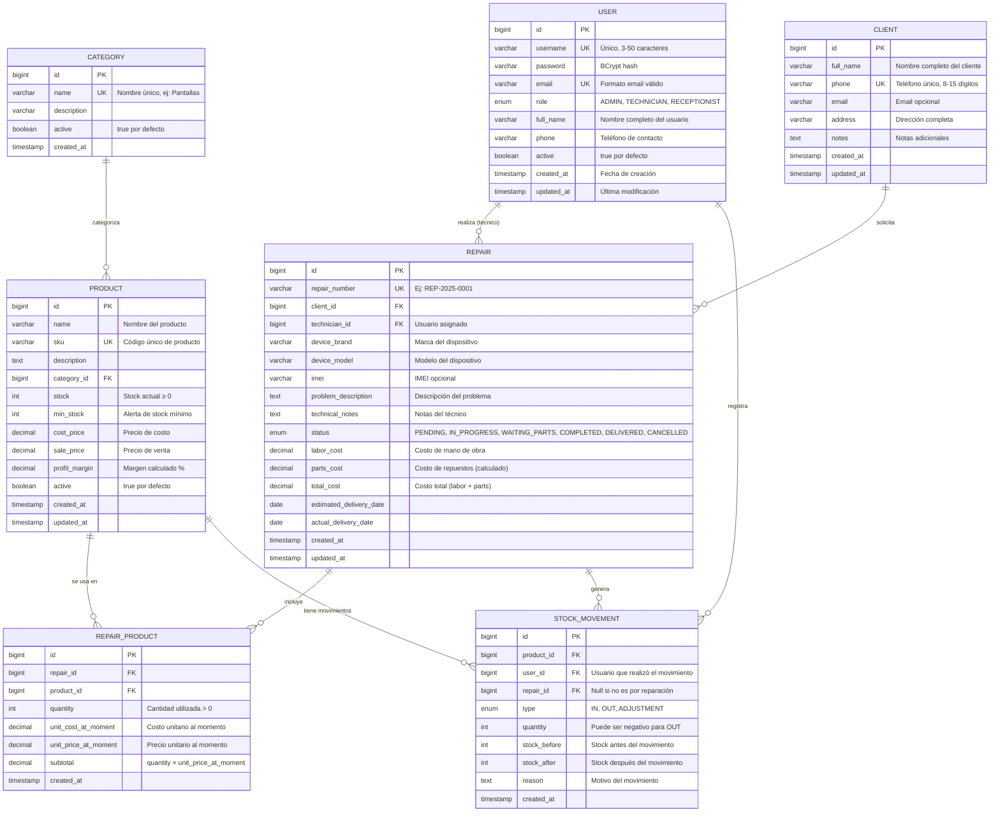

# 📘 **README.md — Sistema mvgr**
_Sistema Integral de Gestión de Repuestos y Reparaciones para Técnicos de Celulares_

---

## 📌 **Descripción del Proyecto**

**mvgr** es una aplicación full-stack moderna diseñada específicamente para técnicos de reparación de dispositivos móviles. El sistema permite una gestión completa del negocio de reparaciones mediante:

### **Funcionalidades Principales**
- 👤 **Gestión de Usuarios**: Sistema de roles (Admin, Técnico, Recepcionista)
- 📱 **Gestión de Clientes**: Registro completo con historial de reparaciones
- 📦 **Control de Inventario**: Categorías, productos, alertas de stock mínimo
- 🔧 **Gestión de Reparaciones**: Desde ingreso hasta entrega con seguimiento de estado
- 💰 **Control Financiero**: Costos, precios y márgenes de ganancia
- 📊 **Reportes y Estadísticas**: Dashboard con métricas del negocio

---

## 🏗️ **Arquitectura del Sistema**

### **Stack Tecnológico**

#### **Backend**
- **Java 21**
- **Spring Boot 3.2+**
- **Spring Security 6** + **JWT** (autenticación stateless)
- **Spring Data JPA** (persistencia)
- **Spring Validation** (validación de datos)
- **MySQL 8.0+** (base de datos principal)
- **Lombok** (reducción de código boilerplate)
- **MapStruct** (mapeo DTO ↔ Entity)
- **Swagger/OpenAPI 3** (documentación API)

#### **Frontend**
- **React 18+** con **TypeScript**
- **Vite** (build tool)
- **React Router v6** (enrutamiento)
- **Axios** (cliente HTTP)
- **React Hook Form** + **Zod** (validación de formularios)
- **TanStack Query** (gestión de estado servidor)
- **Tailwind CSS** (estilos)
- **Shadcn/ui** (componentes UI)
- **Recharts** (gráficos y estadísticas)

---

## 🗂️ **Estructura del Proyecto**

### **Backend - Arquitectura en Capas**

```
mvgr-backend/
├── src/main/java/com/mvgr/
│   ├── config/
│   │   ├── SecurityConfig.java
│   │   ├── JwtConfig.java
│   │   ├── CorsConfig.java
│   │   └── OpenApiConfig.java
│   │
│   ├── controller/
│   │   ├── AuthController.java
│   │   ├── UserController.java
│   │   ├── ClientController.java
│   │   ├── CategoryController.java
│   │   ├── ProductController.java
│   │   ├── RepairController.java
│   │   └── DashboardController.java
│   │
│   ├── dto/
│   │   ├── request/
│   │   │   ├── LoginRequestDto.java
│   │   │   ├── UserCreateDto.java
│   │   │   ├── ClientCreateDto.java
│   │   │   ├── ProductCreateDto.java
│   │   │   └── RepairCreateDto.java
│   │   │
│   │   └── response/
│   │       ├── AuthResponseDto.java
│   │       ├── UserResponseDto.java
│   │       ├── ClientResponseDto.java
│   │       ├── ProductResponseDto.java
│   │       ├── RepairResponseDto.java
│   │       └── DashboardStatsDto.java
│   │
│   ├── entity/
│   │   ├── User.java
│   │   ├── Client.java
│   │   ├── Category.java
│   │   ├── Product.java
│   │   ├── Repair.java
│   │   └── RepairProduct.java
│   │
│   ├── enums/
│   │   ├── UserRole.java
│   │   └── RepairStatus.java
│   │
│   ├── exception/
│   │   ├── GlobalExceptionHandler.java
│   │   ├── ResourceNotFoundException.java
│   │   ├── InsufficientStockException.java
│   │   └── ErrorResponse.java
│   │
│   ├── mapper/
│   │   ├── UserMapper.java
│   │   ├── ClientMapper.java
│   │   ├── ProductMapper.java
│   │   └── RepairMapper.java
│   │
│   ├── repository/
│   │   ├── UserRepository.java
│   │   ├── ClientRepository.java
│   │   ├── CategoryRepository.java
│   │   ├── ProductRepository.java
│   │   ├── RepairRepository.java
│   │   └── RepairProductRepository.java
│   │
│   ├── security/
│   │   ├── JwtTokenProvider.java
│   │   ├── JwtAuthenticationFilter.java
│   │   └── CustomUserDetailsService.java
│   │
│   ├── service/
│   │   ├── AuthService.java
│   │   ├── UserService.java
│   │   ├── ClientService.java
│   │   ├── CategoryService.java
│   │   ├── ProductService.java
│   │   ├── RepairService.java
│   │   └── DashboardService.java
│   │
│   └── MvgrApplication.java
│
├── src/main/resources/
│   ├── application.yml
│   ├── application-dev.yml
│   └── application-prod.yml
│
└── pom.xml
```

### **Frontend - Arquitectura Modular**

```
mvgr-frontend/
├── src/
│   ├── api/
│   │   ├── axios.config.ts
│   │   ├── auth.api.ts
│   │   ├── users.api.ts
│   │   ├── clients.api.ts
│   │   ├── products.api.ts
│   │   └── repairs.api.ts
│   │
│   ├── components/
│   │   ├── common/
│   │   │   ├── Header.tsx
│   │   │   ├── Sidebar.tsx
│   │   │   ├── LoadingSpinner.tsx
│   │   │   └── ErrorBoundary.tsx
│   │   │
│   │   ├── forms/
│   │   │   ├── ClientForm.tsx
│   │   │   ├── ProductForm.tsx
│   │   │   └── RepairForm.tsx
│   │   │
│   │   └── tables/
│   │       ├── ClientsTable.tsx
│   │       ├── ProductsTable.tsx
│   │       └── RepairsTable.tsx
│   │
│   ├── hooks/
│   │   ├── useAuth.ts
│   │   ├── useClients.ts
│   │   ├── useProducts.ts
│   │   └── useRepairs.ts
│   │
│   ├── layouts/
│   │   ├── MainLayout.tsx
│   │   └── AuthLayout.tsx
│   │
│   ├── pages/
│   │   ├── auth/
│   │   │   ├── LoginPage.tsx
│   │   │   └── ForgotPasswordPage.tsx
│   │   │
│   │   ├── dashboard/
│   │   │   └── DashboardPage.tsx
│   │   │
│   │   ├── clients/
│   │   │   ├── ClientsListPage.tsx
│   │   │   ├── ClientDetailPage.tsx
│   │   │   └── ClientCreatePage.tsx
│   │   │
│   │   ├── products/
│   │   │   ├── ProductsListPage.tsx
│   │   │   └── ProductCreatePage.tsx
│   │   │
│   │   └── repairs/
│   │       ├── RepairsListPage.tsx
│   │       ├── RepairDetailPage.tsx
│   │       └── RepairCreatePage.tsx
│   │
│   ├── store/
│   │   ├── authStore.ts
│   │   └── uiStore.ts
│   │
│   ├── types/
│   │   ├── auth.types.ts
│   │   ├── client.types.ts
│   │   ├── product.types.ts
│   │   └── repair.types.ts
│   │
│   ├── utils/
│   │   ├── formatters.ts
│   │   ├── validators.ts
│   │   └── constants.ts
│   │
│   ├── App.tsx
│   └── main.tsx
│
├── package.json
├── tsconfig.json
└── vite.config.ts
```

---

## 🗃️ **Modelo de Datos - Diagrama Entidad-Relación**



---

## 📋 **Reglas de Negocio**

### **1. Gestión de Usuarios**

#### **RN-USR-001: Registro de Usuarios**
- Solo usuarios con rol `ADMIN` pueden crear nuevos usuarios
- Username debe ser único (3-50 caracteres alfanuméricos)
- Email debe ser único y válido
- Password debe tener mínimo 8 caracteres (1 mayúscula, 1 minúscula, 1 número)
- Por defecto, los nuevos usuarios se crean con `active = true`

#### **RN-USR-002: Autenticación**
- El login requiere username/email + password
- JWT con expiración de 24 horas
- Refresh token con expiración de 7 días
- Máximo 5 intentos fallidos antes de bloquear cuenta temporalmente (15 minutos)

#### **RN-USR-003: Roles y Permisos**
- **ADMIN**: Acceso total al sistema
- **TECHNICIAN**: Gestión de reparaciones, productos (solo lectura), clientes
- **RECEPTIONIST**: Gestión de clientes, ingreso de reparaciones (sin modificar estados técnicos)

---

### **2. Gestión de Clientes**

#### **RN-CLI-001: Registro de Clientes**
- El nombre completo es obligatorio (2-100 caracteres)
- El teléfono debe ser único en el sistema
- Formato de teléfono: 8-15 dígitos numéricos
- Email es opcional pero debe ser válido si se proporciona

#### **RN-CLI-002: Búsqueda de Clientes**
- Búsqueda por: nombre, teléfono, email
- Búsqueda case-insensitive
- Autocompletado en formularios de reparación

#### **RN-CLI-003: Eliminación de Clientes**
- No se puede eliminar un cliente con reparaciones activas
- Eliminación lógica (soft delete) recomendada
- Historial de reparaciones debe mantenerse

---

### **3. Gestión de Inventario**

#### **RN-INV-001: Categorías**
- El nombre de categoría debe ser único
- Una categoría no puede eliminarse si tiene productos activos
- Categorías inactivas no aparecen en formularios de creación

#### **RN-INV-002: Productos**
- SKU debe ser único en el sistema
- Stock no puede ser negativo
- Si `stock <= min_stock`, generar alerta automática
- `cost_price` debe ser menor que `sale_price`
- `profit_margin` se calcula automáticamente: `((sale_price - cost_price) / cost_price) × 100`

#### **RN-INV-003: Movimientos de Stock**
- **Entrada (IN)**: Aumenta stock (compras, devoluciones)
- **Salida (OUT)**: Disminuye stock (uso en reparaciones, ventas)
- **Ajuste (ADJUSTMENT)**: Correcciones de inventario (requiere motivo)
- Cada movimiento registra: tipo, cantidad, stock anterior/posterior, usuario, fecha

#### **RN-INV-004: Alertas de Stock**
- Notificación automática cuando `stock <= min_stock`
- Dashboard debe mostrar productos con stock bajo
- Email/notificación a usuarios ADMIN

---

### **4. Gestión de Reparaciones**

#### **RN-REP-001: Creación de Reparación**
- Número de reparación autogenerado: `REP-{YYYY}-{0001}`
- Requiere cliente existente (buscar o crear nuevo)
- Estado inicial: `PENDING`
- Fecha estimada de entrega debe ser futura
- Descripción del problema es obligatoria

#### **RN-REP-002: Estados de Reparación**
Flujo de estados permitido:
1. **PENDING** → IN_PROGRESS | CANCELLED
2. **IN_PROGRESS** → WAITING_PARTS | COMPLETED | CANCELLED
3. **WAITING_PARTS** → IN_PROGRESS | CANCELLED
4. **COMPLETED** → DELIVERED
5. **DELIVERED** (estado final)
6. **CANCELLED** (estado final)

#### **RN-REP-003: Asignación de Técnico**
- Solo usuarios con rol `TECHNICIAN` pueden ser asignados
- Un técnico puede tener múltiples reparaciones activas
- La reasignación debe registrar historial

#### **RN-REP-004: Uso de Repuestos**
- Al agregar un producto a una reparación:
  - Verificar stock disponible (`quantity <= stock`)
  - Registrar precio unitario del momento (congelado)
  - Restar del stock automáticamente
  - Generar movimiento de stock tipo `OUT`
  - Calcular subtotal: `quantity × unit_price_at_moment`

#### **RN-REP-005: Cálculo de Costos**
- `parts_cost` = suma de subtotales de todos los productos usados
- `total_cost` = `labor_cost + parts_cost`
- Los costos se actualizan automáticamente al agregar/quitar productos

#### **RN-REP-006: Finalización de Reparación**
- Para marcar como `COMPLETED`:
  - Debe haber al menos un producto usado O labor_cost > 0
  - Debe tener técnico asignado
  - Notas técnicas son obligatorias
- Al marcar como `DELIVERED`:
  - Registrar fecha real de entrega
  - Cliente debe firmar (registro digital opcional)

#### **RN-REP-007: Cancelación de Reparación**
- Requiere motivo de cancelación
- Si tiene productos usados:
  - Opción 1: Devolver al stock (movimiento tipo `ADJUSTMENT`)
  - Opción 2: No devolver (pérdida registrada)
- No se puede cancelar si estado = `DELIVERED`

---

### **5. Reglas Financieras**

#### **RN-FIN-001: Precios y Márgenes**
- `cost_price` > 0
- `sale_price` > `cost_price`
- `profit_margin` calculado automáticamente
- Histórico de precios para análisis

#### **RN-FIN-002: Facturación**
- El costo total de la reparación es inmutable después de `COMPLETED`
- Registro de pagos parciales (extensión futura)
- Generación de comprobantes PDF

---

### **6. Reportes y Estadísticas**

#### **RN-REP-001: Dashboard Principal**
Métricas en tiempo real:
- Reparaciones activas por estado
- Productos con stock bajo
- Ingresos del mes actual vs mes anterior
- Técnico con más reparaciones completadas
- Tiempo promedio de reparación

#### **RN-REP-002: Reportes Exportables**
- Reparaciones por rango de fechas (Excel/PDF)
- Movimientos de inventario (Excel/PDF)
- Ventas por producto (Excel/PDF)
- Desempeño por técnico

---

## 🔒 **Seguridad**

### **Autenticación y Autorización**
- **JWT** con firma HMAC-SHA256
- Tokens almacenados en `localStorage` (frontend)
- Refresh token en `httpOnly` cookie
- Validación de roles en cada endpoint con `@PreAuthorize`

### **Validaciones de Entrada**
- **Backend**: Bean Validation (JSR-380)
- **Frontend**: React Hook Form + Zod
- Sanitización de inputs para prevenir SQL Injection
- CORS configurado para dominios específicos

### **Manejo de Errores**
- Excepciones personalizadas con códigos HTTP apropiados
- Logs estructurados con nivel adecuado
- No exponer stack traces en producción

---

## 📡 **Especificación de API REST**

### **Endpoints Principales**

#### **Autenticación**
```
POST   /api/auth/login          - Iniciar sesión
POST   /api/auth/refresh        - Renovar token
POST   /api/auth/logout         - Cerrar sesión
POST   /api/auth/forgot-password - Recuperar contraseña
```

#### **Usuarios** (Requiere rol ADMIN)
```
GET    /api/users               - Listar usuarios (paginado)
GET    /api/users/{id}          - Obtener usuario por ID
POST   /api/users               - Crear usuario
PUT    /api/users/{id}          - Actualizar usuario
DELETE /api/users/{id}          - Eliminar usuario (soft delete)
PATCH  /api/users/{id}/activate - Activar/desactivar usuario
```

#### **Clientes**
```
GET    /api/clients             - Listar clientes (paginado, búsqueda)
GET    /api/clients/{id}        - Obtener cliente por ID
GET    /api/clients/{id}/repairs - Historial de reparaciones del cliente
POST   /api/clients             - Crear cliente
PUT    /api/clients/{id}        - Actualizar cliente
DELETE /api/clients/{id}        - Eliminar cliente
```

#### **Categorías**
```
GET    /api/categories          - Listar categorías (activas)
GET    /api/categories/{id}     - Obtener categoría por ID
POST   /api/categories          - Crear categoría (ADMIN)
PUT    /api/categories/{id}     - Actualizar categoría (ADMIN)
DELETE /api/categories/{id}     - Eliminar categoría (ADMIN)
```

#### **Productos**
```
GET    /api/products            - Listar productos (paginado, filtros)
GET    /api/products/{id}       - Obtener producto por ID
GET    /api/products/low-stock  - Productos con stock bajo
GET    /api/products/{id}/movements - Movimientos de stock del producto
POST   /api/products            - Crear producto
PUT    /api/products/{id}       - Actualizar producto
PATCH  /api/products/{id}/stock - Ajustar stock manualmente
DELETE /api/products/{id}       - Eliminar producto (soft delete)
```

#### **Reparaciones**
```
GET    /api/repairs             - Listar reparaciones (paginado, filtros)
GET    /api/repairs/{id}        - Obtener reparación por ID
GET    /api/repairs/{id}/products - Productos usados en la reparación
POST   /api/repairs             - Crear reparación
PUT    /api/repairs/{id}        - Actualizar reparación
PATCH  /api/repairs/{id}/status - Cambiar estado de reparación
POST   /api/repairs/{id}/products - Agregar producto a reparación
DELETE /api/repairs/{id}/products/{productId} - Quitar producto
DELETE /api/repairs/{id}        - Cancelar reparación
```

#### **Dashboard**
```
GET    /api/dashboard/stats     - Estadísticas generales
GET    /api/dashboard/repairs-by-status - Reparaciones agrupadas por estado
GET    /api/dashboard/revenue   - Ingresos por período
GET    /api/dashboard/top-products - Productos más usados
```

---

## 🚀 **Instalación y Ejecución**

### **Backend**

#### **Requisitos Previos**
- JDK 17 o superior
- Maven 3.8+
- MySQL 8.0+

#### **Configuración**

1. **Clonar el repositorio**
```bash
git clone https://github.com/tu-usuario/mvgr-backend.git
cd mvgr-backend
```

2. **Configurar base de datos**
```sql
CREATE DATABASE mvgr_db CHARACTER SET utf8mb4 COLLATE utf8mb4_unicode_ci;
CREATE USER 'mvgr_user'@'localhost' IDENTIFIED BY 'tu_password_seguro';
GRANT ALL PRIVILEGES ON mvgr_db.* TO 'mvgr_user'@'localhost';
FLUSH PRIVILEGES;
```

3. **Configurar application-dev.yml**
```yaml
spring:
  datasource:
    url: jdbc:mysql://localhost:3306/mvgr_db
    username: mvgr_user
    password: tu_password_seguro
  jpa:
    hibernate:
      ddl-auto: update
    show-sql: true

jwt:
  secret: tu_clave_secreta_muy_larga_y_segura_de_al_menos_256_bits
  expiration: 86400000 # 24 horas
```

4. **Ejecutar la aplicación**
```bash
mvn clean install
mvn spring-boot:run -Dspring-boot.run.profiles=dev
```

La API estará disponible en: `http://localhost:8080`  
Documentación Swagger: `http://localhost:8080/swagger-ui.html`

---

### **Frontend**

#### **Requisitos Previos**
- Node.js 18+ y npm/yarn

#### **Instalación**

1. **Clonar el repositorio**
```bash
git clone https://github.com/tu-usuario/mvgr-frontend.git
cd mvgr-frontend
```

2. **Instalar dependencias**
```bash
npm install
```

3. **Configurar variables de entorno**
```env
# .env.development
VITE_API_BASE_URL=http://localhost:8080/api
VITE_APP_NAME=mvgr
```

4. **Ejecutar en modo desarrollo**
```bash
npm run dev
```

La aplicación estará disponible en: `http://localhost:5173`

---

## 📊 **Testing**

### **Backend**
```bash
# Ejecutar todos los tests
mvn test

# Test con cobertura
mvn clean test jacoco:report

# Ver reporte de cobertura
open target/site/jacoco/index.html
```

### **Frontend**
```bash
# Tests unitarios
npm run test

# Tests con cobertura
npm run test:coverage

# Tests E2E con Playwright
npm run test:e2e
```

---

## 📦 **Deployment**

### **Backend - Docker**

```dockerfile
# Dockerfile
FROM eclipse-temurin:17-jdk-alpine
WORKDIR /app
COPY target/mvgr-backend-1.0.0.jar app.jar
EXPOSE 8080
ENTRYPOINT ["java", "-jar", "app.jar"]
```

```bash
docker build -t mvgr-backend:1.0.0 .
docker run -p 8080:8080 -e SPRING_PROFILES_ACTIVE=prod mvgr-backend:1.0.0
```

### **Frontend - Vercel/Netlify**

```bash
# Build de producción
npm run build

# Vista previa del build
npm run preview
```

---

## 🔄 **Plan de Desarrollo (Roadmap)**

### **Fase 1: MVP (4-6 semanas)**
- [x] Diseño de base de datos
- [ ] Entidades JPA y repositorios
- [ ] DTOs y mappers
- [ ] Servicios de negocio
- [ ] Controladores REST
- [ ] Seguridad con JWT
- [ ] Frontend: Login + Dashboard básico
- [ ] CRUD de clientes, productos, reparaciones

### **Fase 2: Funcionalidades Avanzadas (4 semanas)**
- [ ] Gestión avanzada de stock con movimientos
- [ ] Reportes y estadísticas
- [ ] Sistema de notificaciones (stock bajo, reparaciones atrasadas)
- [ ] Exportación de datos (Excel, PDF)
- [ ] Búsqueda avanzada y filtros

### **Fase 3: Optimización (2 semanas)**
- [ ] Tests unitarios y de integración
- [ ] Performance optimization
- [ ] Documentación completa
- [ ] Deploy en producción

### **Fase 4: Extensiones Futuras**
- [ ] Sistema de pagos y facturación
- [ ] Notificaciones push y email
- [ ] App móvil (React Native)
- [ ] Integración con proveedores
- [ ] Sistema de garantías

---

## 📝 **Contribución**

Este proyecto está diseñado como herramienta de aprendizaje. Para contribuir:

1. Fork del repositorio
2. Crear rama feature (`git checkout -b feature/nueva-funcionalidad`)
3. Commit de cambios (`git commit -m 'Agregar nueva funcionalidad'`)
4. Push a la rama (`git push origin feature/nueva-funcionalidad`)
5. Abrir Pull Request

---

## 📄 **Licencia**

Este proyecto es de código abierto bajo la licencia MIT.

---

## 👤 **Autor**

Desarrollado como proyecto de aprendizaje para mejorar habilidades en:
- **Backend**: Java, Spring Boot, JPA, MySQL
- **Frontend**: React, TypeScript, Tailwind CSS
- **Arquitectura**: REST API, Clean Architecture, Patrones de diseño

---

## 📞 **Soporte**

Para preguntas o sugerencias:
- Abrir un Issue en GitHub
- Contactar por email: tu-email@ejemplo.com

---

**¡Gracias por revisar este proyecto! 🚀**